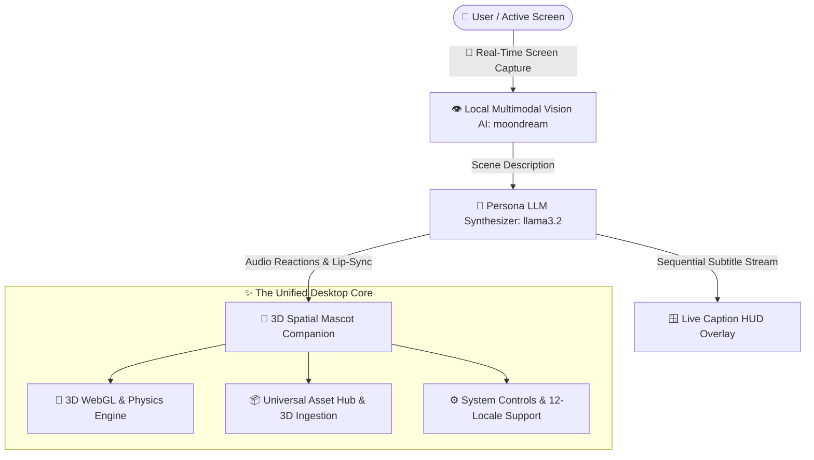
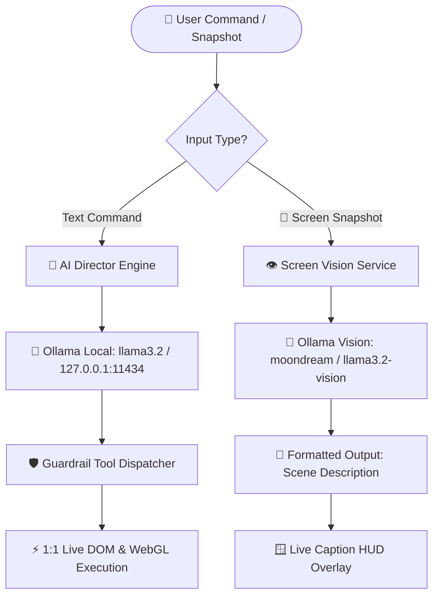

# MascotCaption 3D: Real-Time Screen Auto-Captioning with 3D Mascot Companion 🤖🐰💬

A high-performance, transparent, interactive **3D Desktop Mascot & Real-Time Screen Auto-Captioning Engine** for Windows powered by **Electron**, **Three.js**, **Local Multimodal Vision AI**, and the **AI Function Director & Neural LLM Engine**.

> 📖 **Full User Manual:** For complete guides on Blender viewport navigation, custom 3D model loading, FPS camera flight, physics tossing, dynamic battery saver mode, and 12-language localization, please see **[USER_MANUAL.md](USER_MANUAL.md)**.

---

## ⚡ Core Systems & Studio Capabilities



### 1. ⚡ DevLab: Codex-Clean Autonomous Coding Agent & Native Toolchain
* **Dual-Pane Codex Canvas**: Distraction-free paired programming interface with live code viewer, integrated terminal, syntax highlighting, and 1-click run/save actions.
* **Autonomous Local ReAct Engine**: Multi-turn reasoning loop supporting local models (e.g. `llama3.2`, `qwen2.5-coder`).
* **Universal Compiler & Toolchain Shim**: Auto-detects MSVC (`cl.exe`), provides a transparent GCC/Clang translation shim, and guarantees Node.js and Python availability.
* **Self-Healing Diagnostics**: Automatically analyzes compiler diagnostics and repairs missing headers (`<stdint.h>`, `<math.h>`), struct alignment (`#pragma pack(1)`), CRT safety flags (`_CRT_SECURE_NO_WARNINGS`), and missing dependencies.
* **Continuous AI Learning**: Telemetry and successful code recipes are persisted into `.agent_memory.json` to accelerate future runs.

### 2. 📦 Universal Asset Hub & Companion Customizer (Tab 1: Asset Hub)
* **Central Drag-and-Drop Ingestion**: Universal dropzone supporting 3D Models (`.glb`, `.gltf`, `.fbx`, `.obj`) and Textures (`.png`, `.jpg`, `.webp`, `.svg`).
* **Standardized File Holder Grid**: Instant 1-click selection across procedural 3D models and custom imported GLTF/GLB models:
  * 🤖 **Cyber Android** (`.HUMANOID` • 100% Original IP procedural humanoid with 4 skeletal animation cycles: `Idle Breathing`, `Cheering Wave`, `Victory Dance`, and `Look Around`).
  * 🐰 **Default Bunny** (`.MASCOT` • Procedural cute clay vinyl bunny with physics reactions and toss physics).
  * 📦 **Custom 3D Models** (`.GLB` / `.GLTF` • Drop any custom rigged model into the asset hub).
* **💌 Mascot Mail & Chat Typography**: Live customizable font family (Segoe UI, Comic, Rounded Soft, Vintage Serif, Handwritten, or Custom Font Name) and dynamic font size slider (10px to 28px) for desktop mail and 3D speech bubbles.
* **🗣️ Mascot Speech Voice (TTS)**: Selectable text-to-speech engine with dedicated **Female Voice Presets** (🌸 Anime / Cheerful Girl, 👩 Natural Female, 👧 Cute Pet, 👨 Gentle Male, 🤖 Cyber), dynamic Windows-installed voice picker, pitch (0.5x–2.0x) and speed sliders, and live "▶ Test Voice" preview.
* **🎭 Persona & Character Customizer**: Archetype presets (`Supportive Friend`, `Tsundere Partner`, `Devoted Maid/Butler`, `Cyberpunk AI`, `Study & Focus Buddy`) and free-form persona editor.

### 2. 🎨 Studio, Lighting & Viewport (Tab 2: Studio)
* **Custom Lighting**: Dynamic directional spotlights and ambient lighting intensity controls.
* **Ambient Atmosphere**: GPU-accelerated tumbling Sakura petal rain and crystalline snow fall.
* **Physics & Kinematics**: Real-time velocity, gravity, boundary collision, and 3D physics tossing (Hold `D` + Drag).
* **Blender-Style Viewport Controls**: Orbit (MMB / Alt+Left), Pan (Shift+MMB), Z-Axis Spin (Ctrl+Left Drag), Zoom, and Orthographic view keys (1, 3, 7, 9).

### 3. ⚙️ System, Localization & Neural Hub (Tab 3: System)
* **Centralized Neural LLM Settings**: Ollama background bridge (`127.0.0.1:11434` with `llama3.2`), custom endpoints, model names, API keys, and connection testing.
* **Global Parameters**: Window width/height (30px to 3840px), panel font scale, target frame rate (15–240 FPS), and dynamic battery saver.
* **100% Zero-Missing 12-Language Localization**: Full parity across English, Chinese (Simplified/Traditional), Japanese, Korean, French, German, Spanish (EU/LATAM), Italian, Portuguese, and Russian.
* **Compact Tab-Bar Action**: Relocated "💾 Save & Refresh" button right on the Tab Navigation Bar for instant access.

---

## 🏛️ The "$O(1)$ Complexity" UI Philosophy

Traditional desktop software becomes bloated and unusable over time ($O(N^2)$ complexity growth) as every new feature introduces new menus, sliders, and buttons.

This app implements the **Universal File Holder Standard (`.studio-select-card`)**:
1. **Uniform Visual Contract**: Every selectable asset (Mascots, Models, and imported 3D assets) uses an identical card layout.
2. **Minimalism by Design**: Only essential companion and auto-captioning tools are kept active. Adding new assets introduces **0 new UI complexity**—they are simply ingested as file cards or directed via natural language.

---

## 🤖 Local Neural LLM & Vision Setup



### 1. Built-in Local Text Model (Automatic)
* On application launch, [`main.js`](main.js) automatically starts `ollama.exe serve` on `http://127.0.0.1:11434` with `llama3.2`.

### 2. Local Vision AI Models (100% Private)
To activate local multimodal screen vision, choose any open-source vision model in Ollama:
```powershell
# 🌙 Moondream (Recommended: Ultra-fast & lightweight, 800MB)
ollama run moondream

# 🦙 Meta Llama 3.2 Vision (High capability)
ollama run llama3.2-vision

# 👁️ LLaVA (Open-source visual instruction)
ollama run llava
```

---

## 💻 Locating the Project in CLI

Before running tests or build scripts, navigate your terminal to the project root directory:

### Windows PowerShell / Command Prompt
```powershell
cd C:\Users\space\.gemini\antigravity-ide\scratch\Daysome-Project-T1000-V1
```
*Verify your current path:*
```powershell
Get-Location
# or: dir
```

### Ubuntu CLI / WSL (Windows Subsystem for Linux)
On Linux/WSL, your Windows `C:` drive is mounted under `/mnt/c/`:
```bash
cd /mnt/c/Users/space/.gemini/antigravity-ide/scratch/Daysome-Project-T1000-V1
```
*Verify your current path:*
```bash
pwd
# or: ls -la
```

> [!TIP]
> You can add an alias in your Ubuntu `~/.bashrc` to navigate here instantly:
> ```bash
> echo 'alias gotopet="cd /mnt/c/Users/space/.gemini/antigravity-ide/scratch/Daysome-Project-T1000-V1"' >> ~/.bashrc
> source ~/.bashrc
> ```

---

## 🧪 Automated Unit Testing (18 Suites)

The project includes an automated test runner validating all 18 core subsystems (Physics kinematics, Settings fallbacks, 12-Locale key parity, Reactive AppStore, EventBus, GPU VRAM disposal, Security isolation, Sound volume clamping, SceneStage fallback resilience, SettingsManager texture & flag serialization, AssetRegistry 3D model ingestion, Procedural Humanoid & skeletal animation rigging, Screen Vision AI, Caption Synthesizer, SpeechSynthesis TTS with female voice resolution, Clean Desktop Companion Integrity & Safe Tool Archival, Local Image Generation synthesis, and Mascot Mail 3D flight & Direct Chat bubbles).

### 1. Run Tests Directly in CLI (Node.js)
Works identically across Windows PowerShell and Ubuntu/Linux:
```bash
node tests/run_tests.mjs
```

### 2. Run Tests via Python Rebuilder
Unit tests run automatically as a pre-build validation step before packaging:
```bash
# Windows PowerShell
python rebuild.py

# Ubuntu CLI / WSL
python3 rebuild.py
```

---

## 🚀 Development Mode

### 1. Install Dependencies
```powershell
# Windows PowerShell
npm.cmd install

# Ubuntu CLI / Linux
npm install
```

### 2. Launch Development Window
```powershell
# Windows PowerShell
node ./node_modules/electron/cli.js .

# Or via npm
npm.cmd start
```

---

## 📦 Building the Standalone Executable

### 1. Automated Python Rebuilder [rebuild.py](rebuild.py) (Recommended)

The [rebuild.py](rebuild.py) script automates the complete canonical build, verification, and packaging pipeline:
1. **Process Cleanup**: Terminates running `DesktopPet.exe` instances to release Windows file locks.
2. **Dependency Check**: Verifies `node_modules` and `electron-packager` (auto-runs `npm install` if missing).
3. **Local LLM Daemon Check**: Ensures `ollama.exe serve` is active on `127.0.0.1:11434` with model `llama3.2`.
4. **Automated Unit Testing**: Runs all 18 test suites (`node tests/run_tests.mjs`).
5. **Standalone Packaging**: Packages the standalone binary via `electron-packager` with canonical ignore filters.
   * *WSL Compatibility:* Automatically detects Ubuntu WSL and bridges packaging through `cmd.exe` to avoid the native `rcedit` `/tmp` path collision.
6. **Steam Overlay Configuration**: Copies [steam_appid.txt](steam_appid.txt) into the output directory.
7. **Artifact Verification**: Validates executable existence, file size, and resources.

#### Command Examples:
```bash
# Standard canonical pipeline (test -> package -> steam_appid -> verify)
python rebuild.py                   # Windows PowerShell
python3 rebuild.py                  # Ubuntu CLI / WSL

# Rebuild and immediately launch the application
python rebuild.py --launch

# Fast rebuild skipping the 18 unit tests
python rebuild.py --skip-tests

# Cold-boot asset testing (cleans assets/ folder to verify auto-regeneration)
python rebuild.py --clean-assets

# Package native Linux standalone binary (on Linux / Ubuntu)
python3 rebuild.py --platform=linux --skip-tests

# Or run via npm script
npm.cmd run rebuild
```

#### CLI Options Table:
| Option | Description |
| :--- | :--- |
| `--skip-tests` | Bypasses the 18 automated unit test suites for faster rebuilds. |
| `--launch`, `-l` | Automatically launches the standalone application after packaging. |
| `--platform` | Target platform to package: `win32` (default) or `linux`. |
| `--install-deps` | Runs `npm install` before rebuilding to refresh dependencies. |
| `--clean-assets` | Deletes the `assets/` directory to test cold-boot asset regeneration. |

---

### 2. Manual PowerShell Pipeline

To package the standalone Windows binary manually:

```powershell
Get-Process | Where-Object { $_.Path -like "*DesktopPet*" } | Stop-Process -Force -ErrorAction SilentlyContinue; node ./node_modules/electron-packager/bin/electron-packager.js . DesktopPet --platform=win32 --arch=x64 --ignore="DesktopPet-win32-x64|build_tmp|tests|\.git" --overwrite; Copy-Item steam_appid.txt -Destination DesktopPet-win32-x64\ -Force
```

The output executable is packaged directly at:
```
DesktopPet-win32-x64/
  ├── DesktopPet.exe         <-- Standalone Executable
  ├── steam_appid.txt        <-- Steam Overlay Support (App ID: 4993510)
  └── resources/app/         <-- Bundled Engine Assets
```

To run the standalone application:
```powershell
Start-Process "DesktopPet-win32-x64\DesktopPet.exe"
```

---

## 📁 Repository Structure

```
├── .agents/                      <-- Persistent AI coding rules & context
├── assets/                       <-- Assets directory & default model files
├── locales/                      <-- 12 Language translation dictionaries (en, zh, ja, ko, etc.)
├── src/
│   ├── core/                     <-- 3D WebGL, Audio & Physics Engines
│   │   ├── director/             <-- AI Director tools, domains, telemetry & inspector
│   │   ├── AnimationLoopManager.js
│   │   ├── AppInitializer.js
│   │   ├── GPUAssetManager.js
│   │   ├── HumanoidMascotBuilder.js
│   │   ├── InteractionManager.js
│   │   ├── LightingManager.js
│   │   ├── LLMDirectorEngine.js
│   │   ├── MascotBuilder.js
│   │   ├── MascotInteractionHandler.js
│   │   ├── MascotMailService.js
│   │   ├── ModelLoader.js
│   │   ├── RenderLoopDelegates.js
│   │   ├── SceneStageManager.js
│   │   └── SoundManager.js
│   ├── managers/                 <-- AppStore, SettingsManager & EventBus
│   ├── services/                 <-- Neural & Multimodal Services
│   │   ├── LocalImageGenService.js              <-- Procedural Canvas & Local Visual Synthesis
│   │   ├── ScreenVisionService.js               <-- Local Multimodal Vision Service
│   │   ├── SpeechSynthesisService.js            <-- Offline Web Speech TTS Engine, Female Voice Presets & Mascot Lip-Sync
│   │   └── VisionCaptionSynthesizerService.js   <-- 2-Stage Vision -> LLM Caption Synthesizer
│   └── ui/                       <-- Studio UI & Viewport Controllers
│       ├── AIDirectorTabUI.js
│       ├── AssetHubUI.js
│       ├── CameraViewManager.js
│       ├── DirectChatUI.js                      <-- Desktop Mail & 3D Mascot Chat Bubble UI
│       ├── FormDOMGatherer.js
│       ├── FormSyncManager.js
│       ├── PreviewGenerator.js
│       ├── ScreenVisionBetaUI.js                <-- Beta Screen Vision UI Controller
│       ├── SettingsDiagnosticsUI.js
│       ├── SettingsEventListeners.js
│       ├── SettingsPanelResizeHandler.js
│       ├── SettingsPanelUI.js
│       ├── SettingsSaveHandler.js
│       ├── SettingsUIConfigBuilder.js
│       ├── SettingsUIDelegates.js
│       ├── StudioTabManager.js
│       ├── uiUtils.js
│       └── VisionCaptionSynthesizerBetaUI.js    <-- Vision -> LLM Synthesizer UI Controller
├── index.html                    <-- Studio UI Markup, Asset Hub & Voice Controls
├── style.css                     <-- Modern Studio CSS, Glassmorphism & Animations
├── main.js                       <-- Electron Main, Window Manager & Screen Capturer
├── preload.js                    <-- Sandboxed Security & Screen Capture Bridge
├── renderer.js                   <-- Application Bootstrap & Orchestrator
├── physicsEngine.js              <-- 3D Physics Engine
├── i18nManager.js                <-- 12-Language Localization Engine
├── steam_appid.txt               <-- Steam App Configuration (App ID: 4993510)
├── rebuild.py                    <-- Canonical Rebuild, Test & Packaging Automation
└── tests/
    └── run_tests.mjs             <-- 18-Suite Automated Unit Test Runner
```

---

## 📄 License
MIT License. Created with ❤️ for advanced 3D spatial computing, local AI vision, and desktop companionship.
